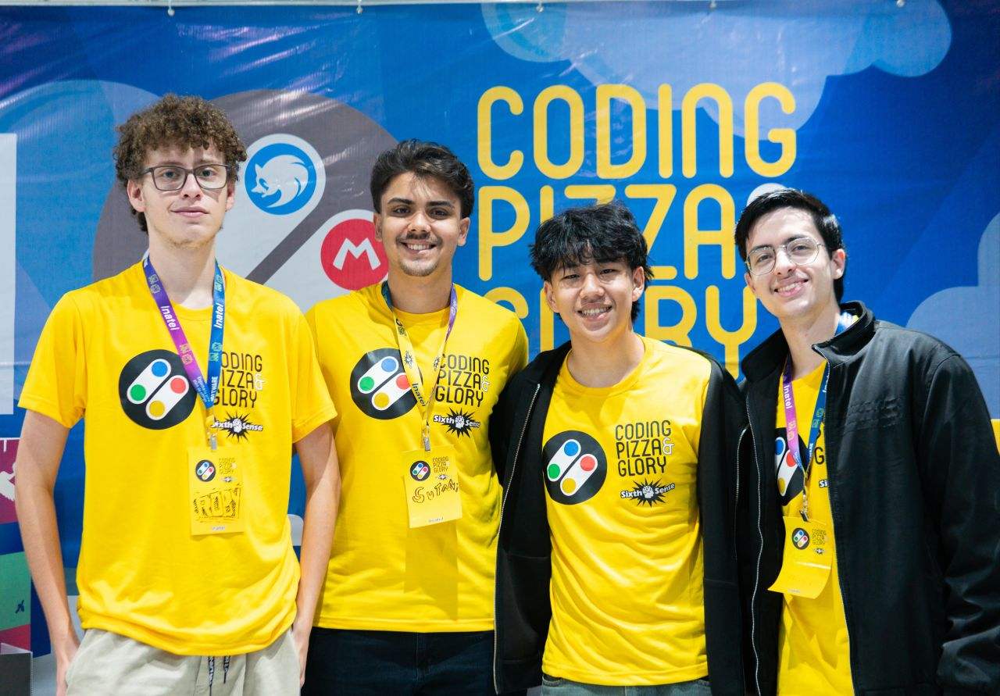

# DP: Divide by Pointer, Derraunde by Pizza

Em um universo alternativo, a sexta edição do **CPG - Coding Pizzza and Glory** não foi sobre programação, mas sobre matemática. Nesse universo, os maiores heróis de Santa Rita do Sapucaí se enfrentam em uma disputa onde uma prova tenta derruba-los a qualquer custo.  
A cada rodada, os jogadores precisam resolver questões matemáticas cada vez mais difíceis antes que o tempo deles acabe e a prova não seja resolvida, similar a um jogo de batata quente.  
Cada resposta correta influencia diretamente o andamento da partida, já que a cada acerto os jogadores podem adicionar mais operações matemáticas na conta atual, ou afetar os adversários com power-ups temáticos como uma lata de Monster que desacelera o tempo, o ChatGPT que resolve a conta atual, uma Calculadora que recomeça a conta, uma NP3 que recupera a vida e um Atestado Médico que redireciona a vez.  
No fim, apenas um participante conseguirá dominar o caos em DP: Divide by Pointer, Derraunde by Pizza e provar que é o verdadeiro gênio da matemática.  

 

  

 

---

## Regras do Jogo

Assim que a partida começa, um dos jogadores é sorteado para responder a uma expressão matemática simples.  

A cada acerto, o jogador escolhe como aumentar a complexidade da conta adicionando novas operações matemáticas. Em seguida, a vez passa para o próximo jogador no sentido horário.  

O jogo termina quando apenas um participante permanecer vivo.

---

## Inspiração

O jogo teve como principais inspirações:

- JKLM.fun
- Batata Quente
- Passa ou Repassa
- Truco

---

## Ferramentas Utilizadas

O jogo foi desenvolvido utilizando **Unity** (2022.3.22f1) e **C#**.

O multiplayer foi implementado a partir do **Photon Engine** e **RPC**.

Os gráficos foram totalmente feitos pelo grupo sem o auxílio de nenhuma ferramenta de inteligência artificial, com os softwares **Aseprite** e **Y**. 

O projeto está hospedado no GitHub Pages para que qualquer pessoa possa jogá-lo diretamente pelo navegador pelo link XXX.

---

## Reconhecimentos

O jogo **DP: Divide by Pointer, Derraunde by Pizza** foi desenvolvido para a sexta edição do **CPG — Coding Pizza and Glory**, um hackathon de desenvolvimento realizado no **INATEL — Instituto Nacional de Telecomunicações**.

O evento ocorreu entre os dias **15/05 e 17/05**, totalizando **36 horas ininterruptas de desenvolvimento**, desafio e colaboração entre equipes.

Ao final da competição, o projeto conquistou o **3º lugar** na avaliação final dos projetos apresentados.

---

## Criadores
- **Davi Motta Vieira Sutani Cardoso** - Back-End  
  [LinkedIn](https://www.linkedin.com/in/davi-sutani-253201369/)
- **Diego Augusto Pereira Silva** - Front-End e Unity  
  [LinkedIn](https://www.linkedin.com/in/diego-augusto-pereira-silva-aa7680345/) | [GitHub](https://github.com/robylag)  
- **Kauã de Oliveira Ribeiro** - Back-End  
  [LinkedIn](https://www.linkedin.com/in/kaua-ribeiro17/) | [GitHub](https://github.com/Kauakim)  
- **Vitor Nolasco Ynoguti** - Front-End  
  [LinkedIn](https://www.linkedin.com/in/vitor-nolasco-ynoguti-a1b95534b/)
